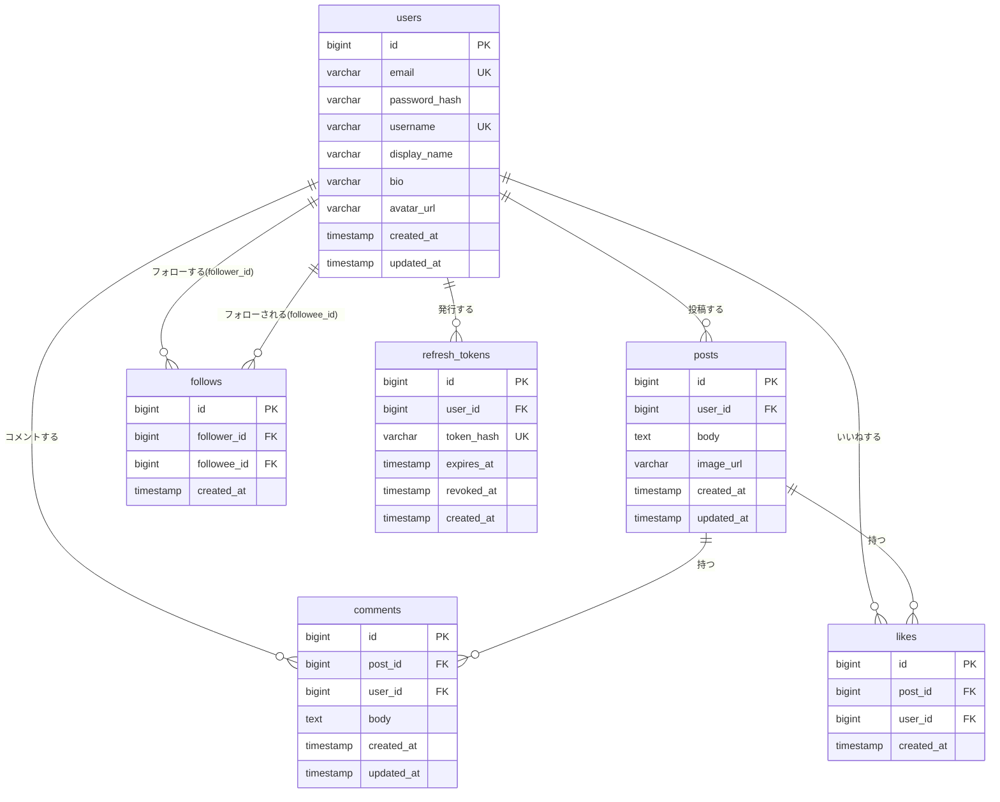
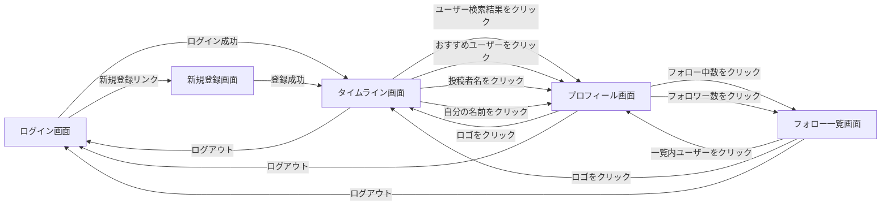

# RaiseTimeLine

X(Twitter)風のタイムライン型SNSアプリです。学習目的で個人開発していますが、複数ユーザーが同時に使うことを前提に設計しています。

ログインしたユーザーは短文投稿（画像添付可）ができ、他ユーザーの投稿にコメント・いいねができます。ユーザー同士はフォロー・フォロワーの関係を持ち、ユーザー検索で他のユーザーを見つけられます。いいね・コメントは投稿者本人だけでなく第三者からの操作も想定しており、いいね数・コメント数・フォロー数・フォロワー数を正しく集計して表示します。

> **現在の状況**: `backend` / `frontend` とも実装済みで、下記の機能はすべて動作します。設計フェーズで作成した [docs/](docs/) 配下のドキュメントは初期構想であり、実装時に一部簡略化しています（差異は各セクションに注記）。

## 機能

- ログイン機能（メールアドレス＋パスワード、JWT認証）
- タイムライン機能（全ユーザーの投稿を新着順に表示、投稿・削除、新着投稿のポーリング通知）
- コメント機能（投稿者本人・第三者を問わずコメント可能、コメント数表示）
- いいね機能（投稿者本人・第三者を問わずいいね可能、いいね数表示、二重いいね防止）
- 画像投稿機能（投稿への画像添付。jpg/png/gif/webp、最大5MB）
- ユーザー検索機能（ユーザー名・表示名によるあいまい検索）
- プロフィール機能（自己紹介の編集、ユーザーごとの投稿一覧）
- フォロー・フォロワー機能（フォロー／フォロー解除、フォロー数・フォロワー数表示、一覧画面、おすすめユーザー表示）

各機能の詳細仕様は [docs/features.md](docs/features.md) と [docs/features/](docs/features/) 配下の個別要件定義書を参照してください（設計時点のもので、実装とは細部が異なる場合があります）。

## 技術スタック

| 役割 | 技術 |
|---|---|
| フロントエンド | HTML + CSS + バニラJavaScript（ビルド不要の静的ファイル） |
| バックエンド | Spring Boot 3.4.5 + Java 21 |
| データベース | PostgreSQL 16 |
| DBアクセス | MyBatis（mybatis-spring-boot-starter 3.0.3、XMLマッパー方式） |
| 認証 | JWT（jjwt 0.12.6）+ BCrypt |
| 画像ストレージ | ローカルディスク（`backend/uploads/images/`）+ Spring Bootの静的リソース配信 |
| ローカル開発環境 | Docker / docker-compose |

> 設計時点（[docs/requirements.md](docs/requirements.md)）ではフロントエンドをReact + Vite、画像ストレージをAWS S3とする想定でしたが、学習用途のシンプルさを優先し、実装ではビルド不要の素のHTML/JS/CSSとローカルディスク保存に変更しています。

## ER図

実装（`backend/src/main/resources/schema.sql`）に基づくテーブル構成です。詳細な集計方針は [docs/er.md](docs/er.md) を参照してください（設計時点のものなので、`follows`テーブルの列名が`followed_id`表記になっている等の差異があります。実装では`followee_id`です）。



- `likes`は`UNIQUE (post_id, user_id)`で二重いいねを防止
- `follows`は`UNIQUE (follower_id, followee_id)`で二重フォローを、`CHECK (follower_id <> followee_id)`で自己フォローを防止（アプリ層でも同様のチェックを実施し二重に防御）

## 画面一覧・画面遷移図

実装済みの画面は5つです（設計時点の [docs/screens.md](docs/screens.md) では投稿詳細画面・プロフィール編集専用画面・10画面構成を想定していましたが、実装ではコメントをタイムライン上のトグル表示に、プロフィール編集を自己紹介のみのインライン編集に簡略化しています）。

| # | 画面 | ファイル | 概要 | 認証要否 |
|---|---|---|---|---|
| 1 | ログイン | `login.html` | メールアドレス＋パスワードでログイン | 不要 |
| 2 | 新規登録 | `register.html` | メールアドレス・パスワード・ユーザー名・表示名で新規登録 | 不要 |
| 3 | タイムライン | `timeline.html` | 投稿一覧・新規投稿（画像添付可）・ユーザー検索・おすすめユーザー | 必要 |
| 4 | プロフィール | `profile.html` | ユーザー情報・自己紹介編集（本人のみ）・フォローボタン・そのユーザーの投稿一覧 | 必要 |
| 5 | フォロー一覧 | `follow-list.html` | 指定ユーザーのフォロー中/フォロワー一覧（`?username=&type=following\|followers`） | 必要 |



## ドキュメント

設計ドキュメント一式は [docs/](docs/) 配下にまとまっています。読む順序や各ドキュメントの概要は [docs/README.md](docs/README.md) を参照してください。

| ドキュメント | 内容 |
|---|---|
| [docs/requirements.md](docs/requirements.md) | 全体要件定義書 |
| [docs/features.md](docs/features.md) | 機能一覧 |
| [docs/features/](docs/features/) | 機能別要件定義書（7機能） |
| [docs/screens.md](docs/screens.md) | 画面設計（画面一覧・画面遷移図・簡易ワイヤーフレーム） |
| [docs/er.md](docs/er.md) | ER図・テーブル定義 |
| [docs/aws.md](docs/aws.md) | AWSインフラ構成（想定案） |

## 必要な環境

- Java 21以上
- Docker（PostgreSQL コンテナ起動用）
- フロントエンドはビルド不要の静的ファイルのため、Node.jsは不要です（任意の静的ファイルサーバーで配信できます）

## 起動方法

### 手動起動

#### 1. データベース（PostgreSQL）

```bash
docker compose up -d --wait
docker compose ps   # State: running / healthy を確認
```

#### 2. バックエンド（Spring Boot） — ポート 8080

```bash
cd backend
./gradlew bootRun
```

起動確認:
```
http://localhost:8080/api/posts
```

#### 3. フロントエンド（静的ファイル） — 任意のポート

`frontend/`配下は素のHTML/CSS/JavaScriptなので、任意の静的ファイルサーバーで配信します（例: Python標準の`http.server`）。

```bash
cd frontend
python3 -m http.server 5500
```

ブラウザで開く:
```
http://localhost:5500/login.html
```

> バックエンドの接続設定は `backend/src/main/resources/application.properties` で変更できます。`app.upload.dir`でアップロード画像の保存先ディレクトリを、`spring.datasource.*`でDB接続先を変更できます。

## テスト用ユーザー

機能追加時の動作確認で、新規登録ユーザーだけでなく既存ユーザーでもログインして確認できるよう、直近の動作確認で作成したユーザーを記録しています。

| ユーザー名 | メールアドレス | 表示名 | パスワード |
|---|---|---|---|
| mybatis_test | mybatis_test@example.com | MyBatisテスト | TestPass1234 |

## Claude Code スキル

このプロジェクトには Claude Code 用のカスタムスキルが含まれています。

| スキル | コマンド | 説明 |
|---|---|---|
| 一括起動 | `/start` | DB・バックエンド・フロントエンドをすべて起動し、起動確認まで行う |

スキルのソースは [.claude/skills/](.claude/skills/) に格納されています。

## ブランチ運用

`main` ブランチへの直接pushは禁止し、Pull Requestを経由してマージします。マージ後のブランチは自動削除されます。
