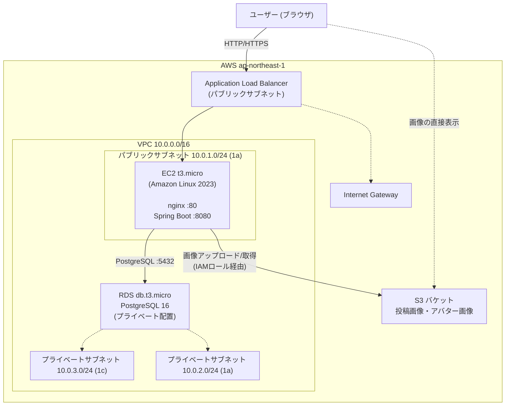
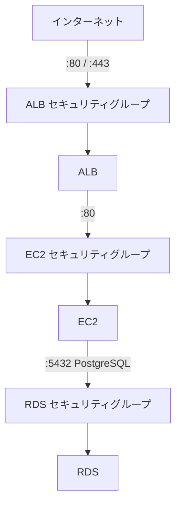
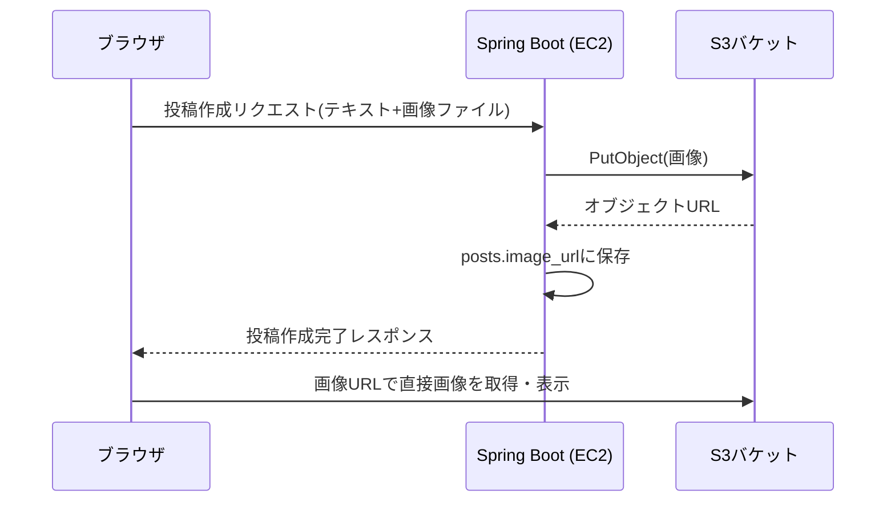

# AWS インフラ構成ドキュメント

> **注意**: 本ドキュメントはAWS上にサーバーを構築する場合の**想定構成**である。AWS上に本番環境を構築するかどうか自体は現時点で未確定。画像ストレージとしてのS3利用のみ決定済み。EC2・RDS・ALBを用いた構成は実装フェーズで確定させる。

TaskManagementプロジェクトの`docs/aws.md`と同様の構成方針（EC2 + RDS）に、ALB（ロードバランサー）とS3（画像ストレージ）を追加した構成とする。リージョンは`ap-northeast-1`（東京）を想定。

---

## 目次

- [全体構成図](#全体構成図)
- [ネットワーク構成](#ネットワーク構成)
- [各サービスの詳細](#各サービスの詳細)
- [セキュリティグループ](#セキュリティグループ)
- [S3・画像アップロードの流れ](#s3画像アップロードの流れ)
- [コスト概算](#コスト概算)
- [未確定事項](#未確定事項)

---

## 全体構成図



---

## ネットワーク構成

### VPC・サブネット

| リソース | CIDR / AZ | 用途 |
|---|---|---|
| VPC | `10.0.0.0/16` | 全リソースを格納する仮想ネットワーク |
| パブリックサブネット | `10.0.1.0/24` / 1a | ALB・EC2 |
| プライベートサブネット A | `10.0.2.0/24` / 1a | RDS |
| プライベートサブネット C | `10.0.3.0/24` / 1c | RDS サブネットグループ要件（最低2AZ） |

TaskManagementの構成と異なり、ユーザーからのアクセスはEC2に直接ではなく**ALB経由**とする。将来的にEC2を複数台構成（Auto Scaling）にする場合も、ALB配下に追加するだけで対応できる。

---

## 各サービスの詳細

### ALB（Application Load Balancer）

| 項目 | 値 |
|---|---|
| 種類 | Application Load Balancer |
| リスナー | HTTP:80（将来的にACM証明書でHTTPS:443化） |
| ターゲット | EC2（ポート80） |
| ヘルスチェック | `/` または `/api/health` |

### EC2（フロントエンド + バックエンド）

| 項目 | 値 |
|---|---|
| インスタンスタイプ | `t3.micro`（無料枠対象） |
| OS | Amazon Linux 2023 |
| ストレージ | gp3 / 20 GB |

```
:80   nginx ── React ビルド済み静的ファイルを配信
                /api/* のリクエストは localhost:8080 へリバースプロキシ
:8080 Spring Boot ── REST API サーバー
```

EC2にはS3へのアップロード権限を持つIAMロールをアタッチし、アクセスキーをコード内に持たない構成とする。

### RDS（データベース）

| 項目 | 値 |
|---|---|
| エンジン | PostgreSQL 16 |
| インスタンスクラス | `db.t3.micro` |
| ストレージ | gp2 / 20 GB |
| パブリックアクセス | 無効（EC2からのみ接続可） |
| デフォルトDB名 | `raisetimeline` |

### S3（画像ストレージ）

| 項目 | 値 |
|---|---|
| バケット用途 | 投稿画像・アバター画像の保存 |
| アクセス制御 | バケットはプライベート。画像配信はバケットポリシー/署名付きURL、または将来的にCloudFront経由を検討 |
| アップロード方式 | バックエンド（Spring Boot）がIAMロールを使ってPutObjectする方式を基本とする |
| ライフサイクル | 学習用途のため特別な世代管理・削除ポリシーは設けない |

---

## セキュリティグループ



| SG | インバウンド | 送信元 |
|---|---|---|
| ALB SG | TCP 80（HTTP） / TCP 443（HTTPS、将来） | `0.0.0.0/0` |
| EC2 SG | TCP 80 | ALB SGのみ |
| EC2 SG | TCP 22（SSH） | `allowed_ip`（自分のIPのみ） |
| RDS SG | TCP 5432（PostgreSQL） | EC2 SGのみ |

S3へのアクセスはセキュリティグループではなく、EC2にアタッチしたIAMロール（S3バケットへのGetObject/PutObject権限）で制御する。

---

## S3・画像アップロードの流れ



---

## コスト概算

新規AWSアカウントの無料枠（12ヶ月間）内での構成を想定。

| サービス | インスタンス | 無料枠 | 超過時の目安 |
|---|---|---|---|
| ALB | 1台 | 無料枠対象外（時間課金あり） | 約$0.0243/時間+LCU課金 |
| EC2 | t3.micro | 750時間/月 | 約$0.0136/時間 |
| RDS | db.t3.micro | 750時間/月 | 約$0.022/時間 |
| S3 | 標準ストレージ | 5GB/月（12ヶ月無料） | 約$0.025/GB/月 |
| EBS | gp3 20GB + gp2 20GB | 30GB/月 | 約$0.096〜0.115/GB/月 |

> ALBは無料枠の対象外のため、学習目的で常時起動する場合は**月$20前後**の追加費用が発生する点に注意。開発中はEC2に直接アクセスする構成（TaskManagement方式）にとどめ、ALBは本番相当の構成を学ぶタイミングで導入する運用も検討可能。

---

## 未確定事項

- AWS上に実際にサーバーを構築するかどうか自体が未確定（ローカルDocker環境のみで開発を完結させる可能性もある）
- ALBを導入するか、TaskManagementと同様にEC2へ直接アクセスする構成にとどめるか
- HTTPS化（ACM証明書 + Route53でのドメイン取得）を行うかどうか
- S3画像配信にCloudFrontを挟むかどうか（現時点は署名付きURLまたはバケット直接参照を想定）
