# E-R図（データ構造）

PostgreSQL 16を想定したテーブル設計。全体像は [requirements.md](./requirements.md#e-r図データ構造) にも概要を記載している。

---

## 目次

- [ER図](#er図)
- [テーブル定義](#テーブル定義)
- [集計方針（いいね数・コメント数・フォロー数）](#集計方針いいね数コメント数フォロー数)

---

## ER図

```mermaid
erDiagram
  USERS ||--o{ POSTS : "投稿する"
  USERS ||--o{ COMMENTS : "コメントする"
  USERS ||--o{ LIKES : "いいねする"
  USERS ||--o{ FOLLOWS : "フォローする(follower_id)"
  USERS ||--o{ FOLLOWS : "フォローされる(followed_id)"
  POSTS ||--o{ COMMENTS : "持つ"
  POSTS ||--o{ LIKES : "持つ"

  USERS {
    bigint id PK
    varchar email UK
    varchar password_hash
    varchar username UK
    varchar display_name
    varchar bio
    varchar avatar_url
    timestamp created_at
    timestamp updated_at
  }
  POSTS {
    bigint id PK
    bigint user_id FK
    text body
    varchar image_url
    timestamp created_at
    timestamp updated_at
  }
  COMMENTS {
    bigint id PK
    bigint post_id FK
    bigint user_id FK
    text body
    timestamp created_at
  }
  LIKES {
    bigint id PK
    bigint post_id FK
    bigint user_id FK
    timestamp created_at
  }
  FOLLOWS {
    bigint id PK
    bigint follower_id FK
    bigint followed_id FK
    timestamp created_at
  }
```

---

## テーブル定義

### users（ユーザー）

| カラム名 | 型 | 制約 | 説明 |
|---|---|---|---|
| id | bigint | PK, auto increment | ユーザーID |
| email | varchar(255) | UNIQUE, NOT NULL | ログイン用メールアドレス |
| password_hash | varchar(255) | NOT NULL | BCryptハッシュ化済みパスワード |
| username | varchar(50) | UNIQUE, NOT NULL | @から始まる一意なユーザー名（検索・URLに使用） |
| display_name | varchar(50) | NOT NULL | タイムライン等に表示される名前 |
| bio | varchar(160) | NULL可 | 自己紹介文 |
| avatar_url | varchar(500) | NULL可 | アイコン画像のS3 URL |
| created_at | timestamp | NOT NULL, default now() | 作成日時 |
| updated_at | timestamp | NOT NULL, default now() | 更新日時 |

### posts（投稿）

| カラム名 | 型 | 制約 | 説明 |
|---|---|---|---|
| id | bigint | PK, auto increment | 投稿ID |
| user_id | bigint | FK → users.id, NOT NULL | 投稿者 |
| body | text | NOT NULL（最大280文字はアプリ側でバリデーション） | 投稿本文 |
| image_url | varchar(500) | NULL可 | 添付画像のS3 URL（1投稿につき1枚まで） |
| created_at | timestamp | NOT NULL, default now() | 投稿日時 |
| updated_at | timestamp | NOT NULL, default now() | 更新日時 |

### comments（コメント）

| カラム名 | 型 | 制約 | 説明 |
|---|---|---|---|
| id | bigint | PK, auto increment | コメントID |
| post_id | bigint | FK → posts.id, NOT NULL | コメント対象の投稿 |
| user_id | bigint | FK → users.id, NOT NULL | コメント投稿者（投稿者本人・第三者どちらも可） |
| body | text | NOT NULL（最大140文字はアプリ側でバリデーション） | コメント本文 |
| created_at | timestamp | NOT NULL, default now() | コメント日時 |

### likes（いいね）

| カラム名 | 型 | 制約 | 説明 |
|---|---|---|---|
| id | bigint | PK, auto increment | いいねID |
| post_id | bigint | FK → posts.id, NOT NULL | いいね対象の投稿 |
| user_id | bigint | FK → users.id, NOT NULL | いいねしたユーザー（投稿者本人・第三者どちらも可） |
| created_at | timestamp | NOT NULL, default now() | いいね日時 |

- `UNIQUE (post_id, user_id)` 制約により、同一ユーザーの同一投稿への二重いいねを防止する

### follows（フォロー関係）

| カラム名 | 型 | 制約 | 説明 |
|---|---|---|---|
| id | bigint | PK, auto increment | フォローID |
| follower_id | bigint | FK → users.id, NOT NULL | フォローする側のユーザー |
| followed_id | bigint | FK → users.id, NOT NULL | フォローされる側のユーザー |
| created_at | timestamp | NOT NULL, default now() | フォロー日時 |

- `UNIQUE (follower_id, followed_id)` 制約により、同一ユーザーへの二重フォローを防止する
- `follower_id <> followed_id` をアプリ側（またはCHECK制約）で保証し、自分自身のフォローを防止する
- 相互フォロー（フォローバック）は `follows` テーブルに2レコード存在する状態として表現する（例: A→B と B→A）

---

## 集計方針（いいね数・コメント数・フォロー数）

複数ユーザーが同時に利用する前提のため、以下の値はリアルタイム性が求められる:

- 投稿のいいね数: `SELECT COUNT(*) FROM likes WHERE post_id = ?`
- 投稿のコメント数: `SELECT COUNT(*) FROM comments WHERE post_id = ?`
- ユーザーのフォロー数: `SELECT COUNT(*) FROM follows WHERE follower_id = ?`
- ユーザーのフォロワー数: `SELECT COUNT(*) FROM follows WHERE followed_id = ?`

**基本方針**: 学習規模のデータ量では正規化した集計クエリ（COUNTクエリ、またはタイムライン取得時のJOIN+GROUP BY）で十分な速度が出るため、まずは集計クエリ方式を採用する。

**将来の拡張案**: データ量やアクセス数が増えてパフォーマンス懸念が出た場合は、`posts.like_count` / `posts.comment_count` / `users.follower_count` / `users.following_count` のような非正規化カウンタカラムを追加し、いいね・コメント・フォローの登録／削除時にアプリ側で更新する方式へ切り替える（今回のスコープでは未実装）。
