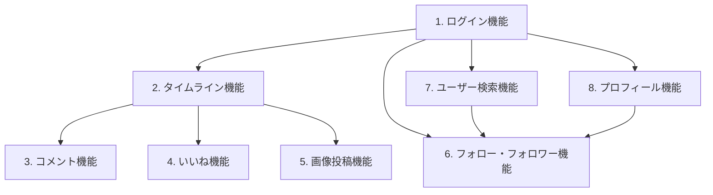

# 機能一覧

本ドキュメントは、アプリが持つ機能の一覧をまとめたインデックスである。
各機能の詳細仕様（ユースケース・権限・入出力・関連テーブル・関連画面）は、機能ごとの個別要件定義書を参照すること。
全体の要件定義は [requirements.md](./requirements.md) を参照。

| # | 機能名 | 概要 | 詳細ドキュメント |
|---|--------|------|------|
| 1 | ログイン機能 | メールアドレス＋パスワードによる新規登録・ログイン・ログアウト（JWT認証） | [01_login.md](./features/01_login.md) |
| 2 | タイムライン機能 | 全ユーザーの投稿を新着順に表示。投稿・削除 | [02_timeline.md](./features/02_timeline.md) |
| 3 | コメント機能 | 投稿への第三者を含むコメント投稿、コメント数の表示 | [03_comment.md](./features/03_comment.md) |
| 4 | いいね機能 | 第三者を含む任意ユーザーによるいいね、いいね数の表示 | [04_like.md](./features/04_like.md) |
| 5 | 画像投稿機能 | 投稿への画像添付（AWS S3に保存） | [05_image_post.md](./features/05_image_post.md) |
| 6 | フォロー・フォロワー機能 | ユーザー同士のフォロー／フォロー解除、フォロー数・フォロワー数の表示 | [06_follow.md](./features/06_follow.md) |
| 7 | ユーザー検索機能 | ユーザー名・表示名によるユーザー検索 | [07_user_search.md](./features/07_user_search.md) |
| 8 | プロフィール機能 | アイコン・表示名・自己紹介の編集、プロフィールの閲覧 | [08_profile.md](./features/08_profile.md) |

## 機能間の依存関係

- ログイン機能はすべての機能の前提となる（未認証ユーザーは利用不可）
- 画像投稿機能はタイムライン機能（投稿フォーム）に内包される形で実装する
- ユーザー検索機能はフォロー機能への導線（検索結果からフォローする）を持つ
- プロフィール機能はマイページ・他ユーザープロフィール画面を提供し、フォロー機能の表示・導線元となる
