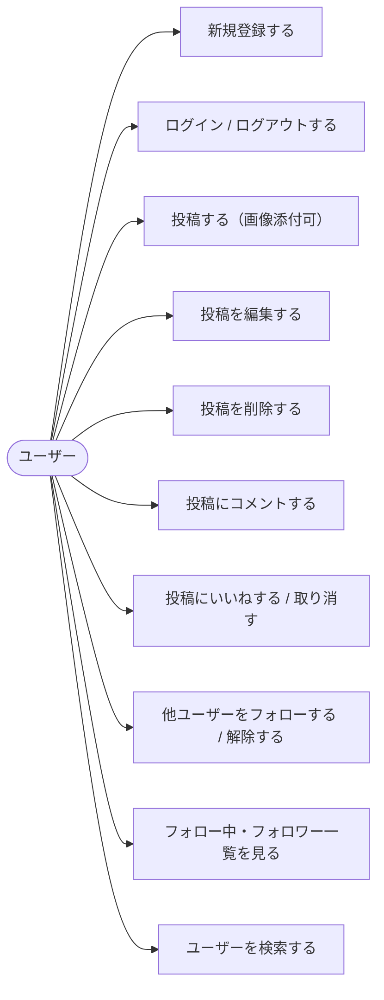
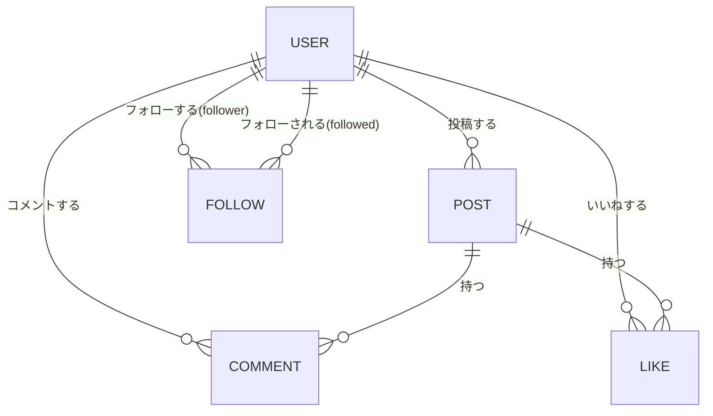
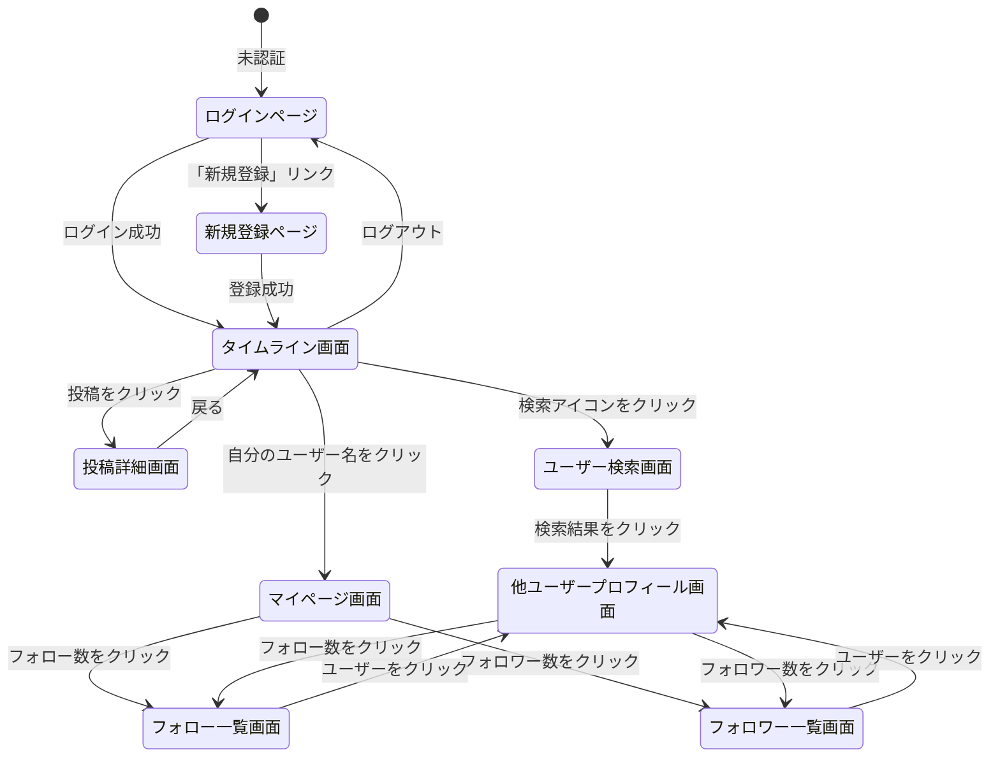

# 要件定義書：X(Twitter)風タイムラインSNSアプリ

## 目次

1. [目的](#目的)
2. [アプリ概要](#アプリ概要)
3. [対象ユーザー](#対象ユーザー)
4. [機能要件](#機能要件)
5. [非機能要件](#非機能要件)
6. [画面構成](#画面構成)
7. [技術スタック](#技術スタック)
8. [対象外（今回は作らない）](#対象外今回は作らない)
9. [ユースケース図](#ユースケース図)
10. [E-R図（データ構造）](#e-r図データ構造)
11. [画面遷移図](#画面遷移図)
12. [用語集](#用語集)

---

## 目的

X(Twitter)のタイムライン形式のSNSアプリを学習目的で作成する。
投稿・コメント・いいね・フォローといった、複数ユーザーが相互にやり取りする典型的なSNSの仕組みを一通り実装し、認証・DB設計・API設計・インフラ構築までを一気通貫で経験することを目的とする。

---

## アプリ概要

ブラウザで動く、アカウント登録制のタイムライン型SNSアプリ。
ログインしたユーザーは短文投稿（画像添付可）ができ、他ユーザーの投稿にコメント・いいねができる。
また、ユーザー同士のフォロー・フォロワー関係を持ち、ユーザー検索によって他ユーザーを見つけられる。

個人開発のアプリではあるが、**複数ユーザーが同時に利用すること**を前提に設計する。そのため、いいね・コメントは投稿者本人だけでなく第三者からの操作も想定し、いいね数・コメント数・フォロー数・フォロワー数を正しく集計・表示できるようにする。

---

## 対象ユーザー

- SNSのタイムライン機能を学習目的で作りたい開発者（自分自身）
- 実際に複数アカウントを作って投稿・コメント・いいね・フォローをやり取りする少人数の利用者

---

## 機能要件

> 機能要件とは「アプリが何をできるか」を定めたもの。各機能の詳細仕様は機能ごとの個別要件定義書（[features.md](./features.md)）を参照。

| # | 機能 | 概要 | 詳細ドキュメント |
|---|------|------|------|
| 1 | ログイン機能 | メールアドレス＋パスワードによる新規登録・ログイン・ログアウト（JWT認証） | [features/01_login.md](./features/01_login.md) |
| 2 | タイムライン機能 | 全ユーザーの投稿を新着順に表示、画像添付投稿・編集・削除 | [features/02_timeline.md](./features/02_timeline.md) |
| 3 | コメント機能 | 投稿への第三者コメント、コメント数の表示 | [features/03_comment.md](./features/03_comment.md) |
| 4 | いいね機能 | 第三者を含む任意ユーザーによるいいね、いいね数の表示 | [features/04_like.md](./features/04_like.md) |
| 5 | 画像投稿機能 | 投稿への画像添付（S3保存） | [features/05_image_post.md](./features/05_image_post.md) |
| 6 | フォロー・フォロワー機能 | ユーザー同士のフォロー／フォロー解除、フォロー数・フォロワー数の表示 | [features/06_follow.md](./features/06_follow.md) |
| 7 | ユーザー検索機能 | ユーザー名・表示名によるユーザー検索 | [features/07_user_search.md](./features/07_user_search.md) |

---

## 非機能要件

> 非機能要件とは「どのくらいの品質か」を定めたもの。

| # | 項目 | 内容 |
|---|------|------|
| 1 | 対応環境 | Chrome / Safari / Firefox（最新版） |
| 2 | レスポンシブ | スマホ・タブレット・PCどれでも見やすい |
| 3 | 表示速度 | ページ読み込みが3秒以内 |
| 4 | セキュリティ | JWT認証・BCryptパスワードハッシュ・所有者チェックによりデータを保護 |
| 5 | 画像保存 | 投稿画像はAWS S3に保存し、URLをDBに保持する |
| 6 | データ整合性 | いいね・フォローの二重登録はDB制約（ユニーク制約）で防止する |

---

## 画面構成

```
┌──────────────────────────────────────────────────────────────┐
│  🐦 SNSアプリ  [🔍 ユーザー検索]  [ユーザー名] [マイページ] [ログアウト] │
├───────────────┬──────────────────────────────────────────────┤
│               │  ＋ 新規投稿フォーム（テキスト＋画像添付）         │
│  ナビゲーション │ ─────────────────────────────────────────── │
│  ・タイムライン │  🧑 ユーザーA          2026-07-14 10:00       │
│  ・マイページ  │  投稿本文テキスト...                          │
│  ・検索       │  [画像]                                      │
│               │  💬 3  ❤️ 12                                 │
│               │ ─────────────────────────────────────────── │
│               │  🧑 ユーザーB          2026-07-14 09:30       │
│               │  投稿本文テキスト...                          │
│               │  💬 0  ❤️ 5                                  │
└───────────────┴──────────────────────────────────────────────┘
```

詳細は [screens.md](./screens.md) を参照。

---

## 技術スタック

> 隣接プロジェクト TaskManagement と同一バージョンで統一する。

| 役割 | 使う技術 | 理由 |
|------|----------|------|
| フロントエンド | React 19（^19.2系）+ Vite 8 | コンポーネント指向で保守性が高い |
| ルーティング | React Router 7 | SPAの画面遷移を管理 |
| HTTPクライアント | axios | API通信 |
| バックエンド | Spring Boot 3.4.5 + Java 21（toolchain） | 型安全・実績あるWebフレームワーク |
| データベース | PostgreSQL 16 | 永続的なデータ保存 |
| 認証 | JWT（jjwt 0.12.6）+ BCrypt | ステートレスな認証・安全なパスワード保存 |
| 画像ストレージ | AWS S3 | 投稿画像の保存（決定済み） |
| ローカル開発環境 | Docker / docker-compose | DB環境を簡単に構築できる |
| 本番インフラ（想定） | AWS EC2 / RDS / ALB / S3 | 詳細は [aws.md](./aws.md) を参照（構成は未確定） |

---

## 対象外（今回は作らない）

- ダイレクトメッセージ（DM）機能
- リポスト（リツイート）機能
- 通知機能
- ハッシュタグ・トレンド機能
- 複数画像添付（画像は1投稿につき1枚まで）
- パスキー認証・OAuthソーシャルログイン（将来実装予定）

---

## ユースケース図



---

## E-R図（データ構造）

詳細なテーブル定義は [er.md](./er.md) を参照。概要は以下の通り。



---

## 画面遷移図

> シングルページアプリのため、認証状態と画面遷移を中心に記述する。詳細は [screens.md](./screens.md) を参照。



---

## 用語集

| 用語 | 意味 |
|------|------|
| ポスト（投稿） | ユーザーが投稿するテキスト＋画像（任意）のコンテンツ |
| タイムライン | 全ユーザーの投稿を新着順に並べた一覧 |
| いいね | 投稿への好意的なリアクション。誰でも1投稿につき1回だけ可能 |
| フォロー | あるユーザーが別のユーザーの投稿を継続的に見るための関係。片方向 |
| フォロワー | 自分をフォローしているユーザー |
| JWT | JSON Web Token。ログイン状態を管理するトークン |
| BCrypt | パスワードを安全にハッシュ化するアルゴリズム |
| S3 | AWSのオブジェクトストレージサービス。投稿画像の保存先 |
