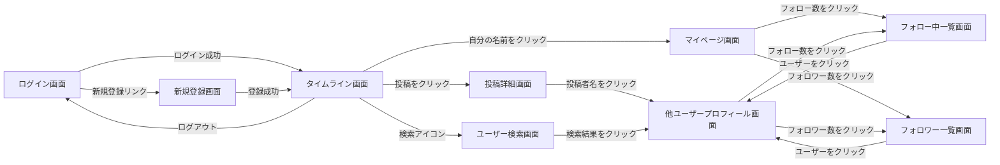

# 画面設計

## 目次

- [画面一覧](#画面一覧)
- [画面遷移図](#画面遷移図)
- [各画面の詳細](#各画面の詳細)

---

## 画面一覧

| # | 画面名 | 概要 | 認証要否 |
|---|--------|------|------|
| 1 | ログイン画面 | メールアドレス＋パスワードでログイン | 不要 |
| 2 | 新規登録画面 | メールアドレス・パスワード・ユーザー名・表示名で新規登録 | 不要 |
| 3 | タイムライン画面 | 全ユーザーの投稿一覧＋新規投稿フォーム | 必要 |
| 4 | 投稿詳細画面 | 投稿本文＋コメント一覧＋コメント投稿フォーム | 必要 |
| 5 | マイページ画面 | 自分のプロフィール・自分の投稿一覧・フォロー数/フォロワー数 | 必要 |
| 6 | 他ユーザープロフィール画面 | 他ユーザーのプロフィール・投稿一覧・フォローボタン | 必要 |
| 7 | フォロー中一覧画面 | あるユーザーがフォローしているユーザー一覧 | 必要 |
| 8 | フォロワー一覧画面 | あるユーザーをフォローしているユーザー一覧 | 必要 |
| 9 | ユーザー検索画面 | ユーザー名・表示名で検索し結果一覧を表示 | 必要 |

---

## 画面遷移図



---

## 各画面の詳細

### 1. ログイン画面

**主要表示項目**: メールアドレス入力欄 / パスワード入力欄 / ログインボタン / 新規登録画面へのリンク

```
┌───────────────────────────────┐
│         🐦 SNSアプリ           │
│                               │
│   メールアドレス                │
│   [______________________]   │
│   パスワード                   │
│   [______________________]   │
│                               │
│   [        ログイン        ]   │
│                               │
│   アカウントをお持ちでない方は    │
│   → 新規登録                  │
└───────────────────────────────┘
```

**主な操作**: ログイン（成功時タイムライン画面へ遷移、失敗時エラーメッセージ表示）

---

### 2. 新規登録画面

**主要表示項目**: メールアドレス / パスワード / ユーザー名（@handle） / 表示名 / 登録ボタン

```
┌───────────────────────────────┐
│         新規登録               │
│                               │
│   メールアドレス [___________] │
│   パスワード    [___________] │
│   ユーザー名(@) [___________] │
│   表示名        [___________] │
│                               │
│   [        登録する        ]   │
└───────────────────────────────┘
```

**主な操作**: 登録（成功時タイムライン画面へ自動ログイン遷移）

---

### 3. タイムライン画面

**主要表示項目**: ヘッダー（検索アイコン・自分の名前・ログアウト） / 新規投稿フォーム（本文＋画像添付） / 投稿一覧（投稿者名・本文・画像・コメント数・いいね数・いいねボタン）

```
┌─────────────────────────────────────────────────┐
│ 🐦 SNSアプリ   [🔍検索] [ユーザー名 ▼]            │
├─────────────────────────────────────────────────┤
│ [本文を入力...______________] [画像を選択] [投稿] │
├─────────────────────────────────────────────────┤
│ 🧑 表示名 @username        2026-07-14 10:00      │
│ 投稿本文がここに表示される                          │
│ [添付画像]                                        │
│ 💬 3件のコメント   ❤️ 12件のいいね  [♡いいね]      │
├─────────────────────────────────────────────────┤
│ 🧑 表示名2 @username2       2026-07-14 09:30      │
│ 投稿本文...                                        │
│ 💬 0件のコメント   ❤️ 5件のいいね  [♡いいね]       │
└─────────────────────────────────────────────────┘
```

**主な操作**: 投稿作成（テキスト＋任意で画像1枚） / いいね・いいね解除 / 投稿削除（自分の投稿のみ） / 投稿クリックで投稿詳細画面へ

---

### 4. 投稿詳細画面

**主要表示項目**: 投稿本文全体 / いいね数・コメント数 / コメント一覧（コメント投稿者・本文・日時） / コメント投稿フォーム

```
┌─────────────────────────────────────────────────┐
│ ← 戻る                                            │
├─────────────────────────────────────────────────┤
│ 🧑 表示名 @username         2026-07-14 10:00      │
│ 投稿本文がここに表示される                          │
│ [添付画像]                                        │
│ ❤️ 12件のいいね  [♡いいね]                        │
├─────────────────────────────────────────────────┤
│ コメントを入力... [______________] [送信]          │
├─────────────────────────────────────────────────┤
│ 🧑 コメント投稿者A  2026-07-14 10:05               │
│ コメント本文...                                    │
├─────────────────────────────────────────────────┤
│ 🧑 コメント投稿者B  2026-07-14 10:10               │
│ コメント本文...                                    │
└─────────────────────────────────────────────────┘
```

**主な操作**: コメント投稿 / コメント削除（自分のコメントのみ） / いいね・いいね解除

---

### 5. マイページ画面 / 6. 他ユーザープロフィール画面

**主要表示項目**: アイコン・表示名・@ユーザー名・自己紹介 / フォロー数・フォロワー数（クリックで一覧画面へ） / （他ユーザーの場合）フォロー／フォロー解除ボタン / 自分の投稿一覧

```
┌─────────────────────────────────────────────────┐
│ ← 戻る                                            │
├─────────────────────────────────────────────────┤
│  🧑（アイコン）  表示名 @username                  │
│  自己紹介文がここに表示される                        │
│  [フォロー中: 12]   [フォロワー: 34]                │
│  （他ユーザー画面のみ） [ フォローする / フォロー中 ]  │
├─────────────────────────────────────────────────┤
│  このユーザーの投稿一覧                             │
│  🧑 表示名 @username    2026-07-14 10:00           │
│  投稿本文...  💬2 ❤️5                              │
└─────────────────────────────────────────────────┘
```

**主な操作**: フォロー／フォロー解除（他ユーザー画面のみ） / フォロー数・フォロワー数クリックで一覧画面へ

---

### 7. フォロー中一覧画面 / 8. フォロワー一覧画面

**主要表示項目**: 対象ユーザーのアイコン・表示名・@ユーザー名一覧 / 各行にフォロー／フォロー解除ボタン

```
┌─────────────────────────────────────────────────┐
│ ← 戻る   フォロー中（12）                          │
├─────────────────────────────────────────────────┤
│ 🧑 表示名A @usernameA        [フォロー中]           │
│ 🧑 表示名B @usernameB        [フォローする]          │
│ 🧑 表示名C @usernameC        [フォロー中]           │
└─────────────────────────────────────────────────┘
```

**主な操作**: 一覧内のユーザーをクリックしてプロフィール画面へ遷移 / その場でフォロー・フォロー解除

---

### 9. ユーザー検索画面

**主要表示項目**: 検索入力欄（ユーザー名・表示名） / 検索結果一覧（アイコン・表示名・@ユーザー名・フォロー状態）

```
┌─────────────────────────────────────────────────┐
│ 🔍 [_________________________] 検索               │
├─────────────────────────────────────────────────┤
│ 🧑 表示名A @usernameA        [フォローする]          │
│ 🧑 表示名B @usernameB        [フォロー中]           │
└─────────────────────────────────────────────────┘
```

**主な操作**: キーワード検索（部分一致） / 検索結果からプロフィール画面へ遷移 / 検索結果からその場でフォロー
